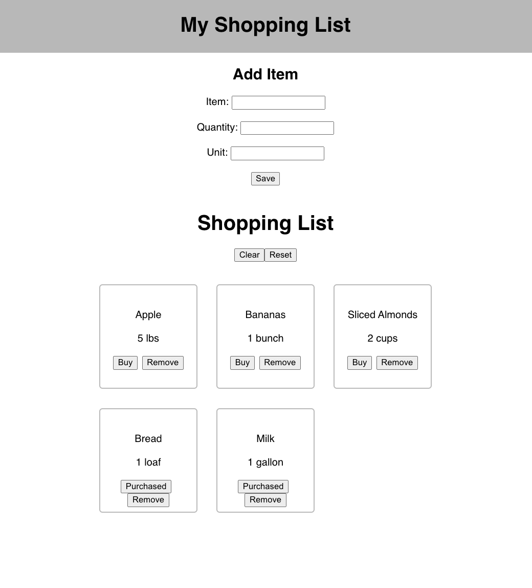

# React Shopping List

## Description

This project is a shopping list app that can store a list of items in a database. This allows the user to build up a list over time and then eventually go shopping!

At the top of the page, a form allows the user to input an item name, quantity and unit (lbs, gallons, etc). When the `Save` button is clicked, the values of these inputs are store in the database and displayed below. Each item is also displayed with a `Buy` button to mark the item as purchased and a `Remove` button to delete the item from the list and the database.

At the top of the list, a `Clear` button allows the user to delete ALL items from the list and the database. And a `Reset` button allows the user to reset the purchased status of all items so that the list can be used again.

## Screenshot

## Prerequisites

1. Node.js
2. React
3. PostgreSQL

## Installation

1. Create a database using PostgreSQL and name it `shopping_list`
2. Create a table and insert the values as shown in database.sql
3. Run `npm install` in your terminal
4. Run `npm run server` in your terminal
5. Run `npm run client` in a different terminal window

## Acknowledgement

Thanks to my group members for helping complete this assignment and for being awesome!

Glonel Dimapilis
https://github.com/ggSushi

Jakob Engler
https://github.com/jengler22
